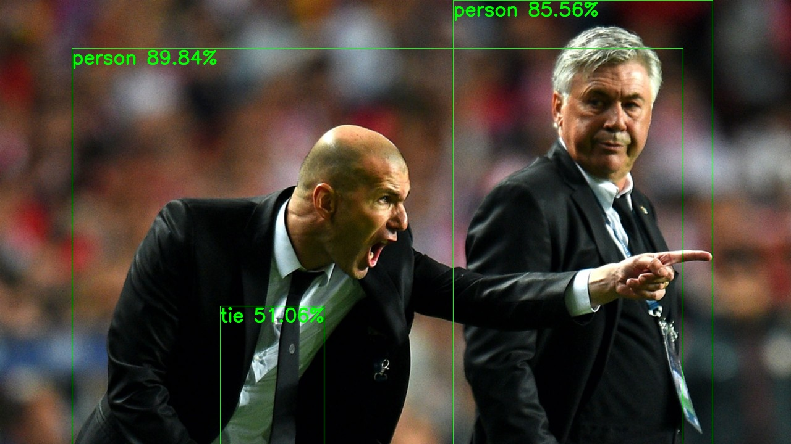

# YOLOv5 Pytorch Inference

## Inference 

'''bash
$ python simple_inference.py --image inference/images/test.jpg 
'''

## Output

## Pretrained Checkpoints

| Model | APval | APtest | AP50 | SpeedGPU | FPSGPU | params | FLOPs |
|---------- |------ |------ |------ | -------- | ------| ------ |------  |  :------: |
| YOLOv5-s ([ckpt](https://drive.google.com/open?id=1Drs_Aiu7xx6S-ix95f9kNsA6ueKRpN2J))    | 35.5     | 35.5     | 55.0     | **2.1ms** | **476** | 7.1M   | 12.6B
| YOLOv5-m ([ckpt](https://drive.google.com/open?id=1Drs_Aiu7xx6S-ix95f9kNsA6ueKRpN2J))    | 42.7     | 42.7     | 62.4     | 3.2ms     | 312     | 22.0M  | 39.0B
| YOLOv5-l ([ckpt](https://drive.google.com/open?id=1Drs_Aiu7xx6S-ix95f9kNsA6ueKRpN2J))    | 45.7     | 45.9     | 65.1     | 4.1ms     | 243     | 50.3M  | 89.0B
| YOLOv5-x ([ckpt](https://drive.google.com/open?id=1Drs_Aiu7xx6S-ix95f9kNsA6ueKRpN2J))    | **47.2** | **47.3** | **66.6** | 6.5ms     | 153     | 95.9M  | 170.3B

##For Training refer

## Licence

## Credits
